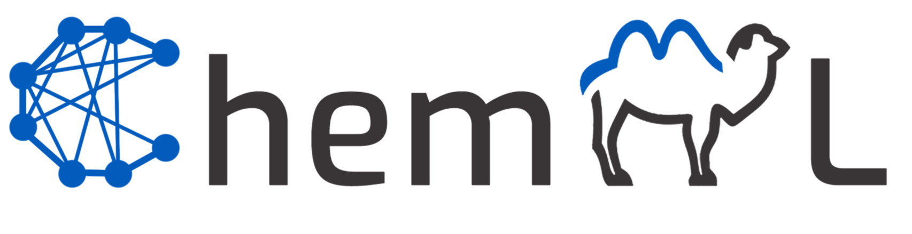

# ChemML
ChemML is a machine learning and informatics program suite for the analysis, mining, and modeling of chemical and materials data.
Please check the [ChemML website](https://hachmannlab.github.io/chemml) for more information.

   - ChemML documentation: https://hachmannlab.github.io/chemml

  
 

## Code Design:
ChemML is developed in the Python 3 programming language and makes use of a host of data analysis and ML libraries(accessible through the Anaconda distribution), as well as domain-specific libraries. 
The development follows a strictly modular and object-oriented design to make the overall code as flexible and versatile as possible.

The format of library is similar to the well known libraries like Scikit-learn. 

## Latest Version:
   - to find out about the latest version and release history, click [here](https://pypi.org/project/chemml/#history)

## Installation and Dependencies:
You can download ChemML from PyPI via pip.

    pip install chemml --user -U

Here is a list of external libraries that will be installed with chemml:
   - numpy
   - pandas
   - tensorflow
   - scikit-learn
   - matplotlib
   - seaborn
   - lxml
   - openpyxl
   - ipywidgets

We strongly recommend you to install ChemML in an Anaconda environment. The instructions to create the environment, install ChemML’s dependencies, and subsequently install Chemml using the Python Package Index (PyPI) via pip are as follows:

    conda create --name chemml_env python=3.8
    source activate chemml_env
    conda install -c conda-forge openbabel rdkit nb_conda_kernels python-graphviz
    pip install chemml

## Citation:
Please cite the use of ChemML as:

    Main citation:

    @article{chemml2019,
    author = {Haghighatlari, Mojtaba and Vishwakarma, Gaurav and Altarawy, Doaa and Subramanian, Ramachandran and Kota, Bhargava Urala and Sonpal, Aditya and Setlur, Srirangaraj and Hachmann, Johannes},
    journal = {ChemRxiv},
    pages = {8323271},
    title = {ChemML: A Machine Learning and Informatics Program Package for the Analysis, Mining, and Modeling of Chemical and Materials Data},
    doi = {10.26434/chemrxiv.8323271.v1},
    year = {2019}
    }

    
    Other references:

    @article{chemml_review2019,
    author = {Haghighatlari, Mojtaba and Hachmann, Johannes},
    doi = {https://doi.org/10.1016/j.coche.2019.02.009},
    issn = {2211-3398},
    journal = {Current Opinion in Chemical Engineering},
    month = {jan},
    pages = {51--57},
    title = {Advances of machine learning in molecular modeling and simulation},
    volume = {23},
    year = {2019}
    }

    @article{Hachmann2018,
    author = {Hachmann, Johannes and Afzal, Mohammad Atif Faiz and Haghighatlari, Mojtaba and Pal, Yudhajit},
    doi = {10.1080/08927022.2018.1471692},
    issn = {10290435},
    journal = {Molecular Simulation},
    number = {11},
    pages = {921--929},
    title = {Building and deploying a cyberinfrastructure for the data-driven design of chemical systems and the exploration of chemical space},
    volume = {44},
    year = {2018}
    }

    @article{vishwakarma2019towards,
    title={Towards autonomous machine learning in chemistry via evolutionary algorithms},
    author={Vishwakarma, Gaurav and Haghighatlari, Mojtaba and Hachmann, Johannes},
    journal={ChemRxiv preprint},
    year={2019}
    }

## License:
ChemML is copyright (C) 2014-2022 Johannes Hachmann and Mojtaba Haghighatlari, Aditya Sonpal, Gaurav Vishwakarma and Aatish Pradhan all rights reserved.
ChemML is distributed under 3-Clause BSD License (https://opensource.org/licenses/BSD-3-Clause).

## About us:

### Maintainers:
    - Johannes Hachmann, hachmann@buffalo.edu
    - Mojtaba Haghighatlari
    - Aditya Sonpal, adityaso@buffalo.edu
    - Aatish Pradhan, aatishpr@buffalo.edu
    University at Buffalo - The State University of New York (UB)

### Contributors:
    - Doaa Altarawy (MolSSI): scientific advice and software mentor 
    - Gaurav Vishwakarma (UB): automated model optimization
    - Ramachandran Subramanian (UB): Magpie descriptor library port
    - Bhargava Urala Kota (UB): library database
    - Aditya Sonpal (UB): graph convolution NNs
    - Srirangaraj Setlur (UB): scientific advice
    - Venugopal Govindaraju (UB): scientific advice
    - Krishna Rajan (UB): scientific advice
    - Aatish Pradhan (UB): Jupyter GUI developer

    - We encourage any contributions and feedback. Feel free to fork and make pull-request to the "development" branch.

### Acknowledgements:
    - ChemML is based upon work supported by the U.S. National Science Foundation under grant #OAC-1751161 and in part by #OAC-1640867.
    - ChemML was also supported by start-up funds provided by UB's School of Engineering and Applied Science and UB's Department of Chemical and Biological Engineering, the New York State Center of Excellence in Materials Informatics through seed grant #1140384-8-75163, and the U.S. Department of Energy under grant #DE-SC0017193.
    - Mojtaba Haghighatlari received 2018 Phase-I and 2019 Phase-II Software Fellowships by the Molecular Sciences Software Institute (MolSSI) for his work on ChemML.

