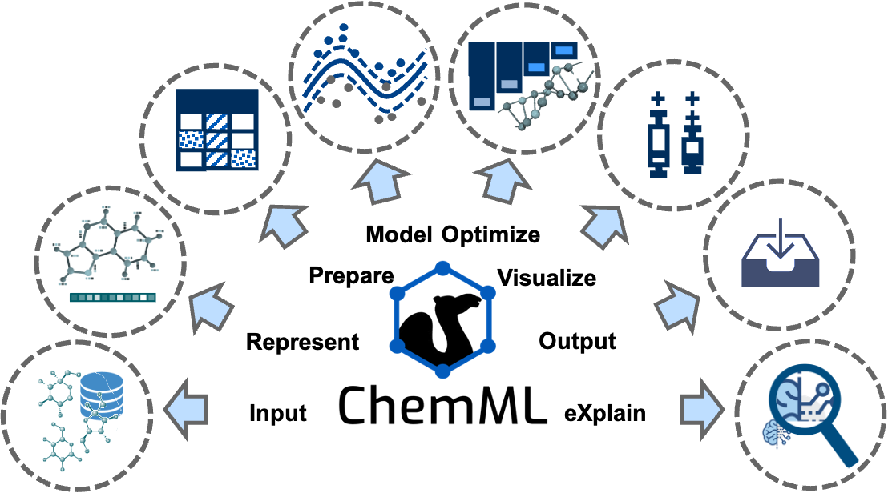

Introduction to ChemML Library
==============================

ChemML is an open machine learning (ML) and informatics program suite that is designed to support and advance the data-driven research paradigm that is currently emerging in the chemical and materials domain. ChemML allows its users to perform various data science tasks and execute ML workflows that are
adapted specifically for the chemical and materials context. Key features are automation, general-purpose utility, versatility, and user-friendliness in order to make the application of modern data science a viable and widely accessible proposition in the broader chemistry and materials community. ChemML is also designed to facilitate methodological innovation, and it is one of the cornerstones of the software ecosystem for data-driven in silico research.

We give a brief overview of the types of methods that are covered by each of the core task classes shown in figure above, and we mention notable innovation as well as key third-party libraries ChemML utilizes in these tasks.

- Input/output (I/O)
   ChemML provides several methods to read and parse input files (e.g., containing data sets, libraries of molecules, or trained models) in various formats and store the outputs of ChemML's operations. ChemML uses Numpy and Pandas libraries for the majority of basic data manipulation tasks. It provides three main classes to manipulate the chemical information of molecular or crystal structures. These classes are supported by the popular cheminformatics codes OpenBabel, RDKit and Magpie.

- Represent
   The choice of feature representation is one of the most important aspects of an ML approach and an obvious place to infuse the physics of a given data set into the desired model. ChemML includes implementations of numerous feature representation methods, including Coulomb matrix, bag-of-bonds, local atomic and bond features for deep learning (DL), interfaces for RDKit fingerprints and molecular descriptors from Dragon, as well as a Python
   reimplementation of all composition-based and crystal-structure-based features available in the Magpie library. It also covers our original work on fingerprint and feature engineering.

- Prepare
   The data preparation techniques in ChemML allow us to alleviate issues associated with one-to-many and many-to-one mappings. They also allow us to remove redundant or otherwise irrelevant features using feature transformation and feature selection techniques.

- Model
   To date, our focus in developing ChemML has been on supervised ML techniques. For core ML tasks in the creation of these models, we utilize popular and efficient libraries including scikit-learn, Tensorflow, and Keras. This task class also includes crucial facilities for model assessment, validation, and evaluation. The original model contributions developed and maintained within ChemML include physics-informed DL architectures and pre-tuned ML models for the prediction of particular molecular properties.

- Optimize
   This task class provides methods to quantify and improve both the accuracy and reliability of predictions. We can optimize a given model in  hyper-parameter space using a coarse grid search or evolutionary algorithm. In addition, ML design methodologies such as active learning (AL) and transfer learning (TL) are available to enhance the efficiency of the exploration of compound space. The available optimization methods link to other elements of an ML workflow and ChemML allows us to automatize the modeling of specified search spaces.

- Visualize
   Data visualization methods that help facilitate a better comprehension of the modeling results are available via a separate module, which builds on the Matplotlib and Seaborn libraries for key visualization elements. These elements are accessible as part of any ML workflow.

Citation:
+++++++++
Please cite the use of ChemML as:

::

   Main citation:

   @article{chemml2019,
   author = {Haghighatlari, Mojtaba and Vishwakarma, Gaurav and Altarawy, Doaa and Subramanian, Ramachandran and Kota, Bhargava Urala and Sonpal, Aditya and Setlur, Srirangaraj and Hachmann, Johannes},
   journal = {ChemRxiv},
   pages = {8323271},
   title = {ChemML: A Machine Learning and Informatics Program Package for the Analysis, Mining, and Modeling of Chemical and Materials Data},
   doi = {10.26434/chemrxiv.8323271.v1},
   year = {2019}
   }