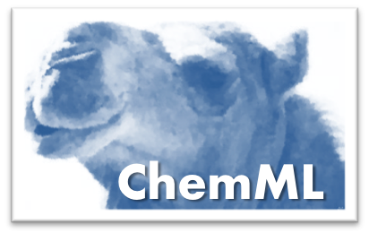

.. ChemML documentation master file, created by
   sphinx-quickstart on Thu Jun  2 13:42:11 2016.
   You can adapt this file completely to your liking, but it should at least
   contain the root `toctree` directive.

|logo|

Welcome to the ChemML's documentation!
======================================
ChemML is a machine learning and informatics program suite for the analysis, mining, and modeling of chemical and materials data.

ChemML is developed in the Python 3 programming language and makes use of a host of data analysis and ML libraries, as well as domain-specific libraries. The development follows a strictly modular and object-oriented design to make the overall code as flexible and versatile as possible.

Latest Version:
+++++++++++++++
    - to find out about the latest version and release history, `click here <https://github.com/hachmannlab/chemml/releases>`_
    - `source repository on github <https://github.com/hachmannlab/chemml>`_
    - for a detailed list of changes, see the :doc:`Changelog <changelog>`

Installation and Dependencies:
++++++++++++++++++++++++++++++
We strongly recommend you install ChemML in an Anaconda environment. The instructions to create the environment and install ChemML are as follows: 

.. code:: bash

    conda create --name chemml_env python=3.13
    source activate chemml_env 
    # Make sure to run this command in a clean location
    git clone https://github.com/hachmannlab/chemml.git
    pip install ./chemml

Note: Here is a list of external libraries that will be installed with chemml:
   - numpy
   - pandas
   - tensorflow
   - rdkit
   - scikit-learn
   - matplotlib
   - seaborn
   - lxml
   - openpyxl
   - ipywidgets
   - shap
   - lime
   - openbabel 
        - (NOTE: Python 3.8 requires a separate conda install of openbabel) 
        .. code:: bash

            conda install -c conda-forge openbabel
   - torch
   - torchvision

Optional dependencies (user-installed):
+++++++++++++++++++++++++++++++++++++++
- python-graphviz, nb_conda_kernels (for ChemML Jupyter wrapper)
- xgboost, lightgbm (if you want to include these models for AutoML screening)
- Additional PyTorch libraries depending on operating system and GPU configuration, `see here <https://pytorch.org/get-started/locally/>`_.

Errors during installation:
++++++++++++++++++++++++++++++
After installing ChemML in an Anaconda environment, you may run into the following error with respect to the rdkit module: 

.. code:: bash

    ImportError: /lib64/libstdc++.so.6: version `CXXABI_1.3.9' not found

Solution: Activate the environment in which you have installed ChemML and use the following code:

.. code:: bash
   
    export LD_LIBRARY_PATH=$LD_LIBRARY_PATH:/path/to/chemml_env/lib

Citation:
+++++++++
Please cite the use of ChemML as:

::

    Main citation:

    @article{chemml2019,
    author = {Haghighatlari, Mojtaba and Vishwakarma, Gaurav and Altarawy, Doaa and Subramanian, Ramachandran and Kota, Bhargava Urala and Sonpal, Aditya and Setlur, Srirangaraj and Hachmann, Johannes},
    journal = {ChemRxiv},
    pages = {8323271},
    title = {ChemML: A Machine Learning and Informatics Program Package for the Analysis, Mining, and Modeling of Chemical and Materials Data},
    doi = {10.26434/chemrxiv.8323271.v1},
    year = {2019}
    }

    Other references:

    @article{chemml_review2019,
    author = {Haghighatlari, Mojtaba and Hachmann, Johannes},
    doi = {https://doi.org/10.1016/j.coche.2019.02.009},
    issn = {2211-3398},
    journal = {Current Opinion in Chemical Engineering},
    month = {jan},
    pages = {51--57},
    title = {Advances of machine learning in molecular modeling and simulation},
    volume = {23},
    year = {2019}
    }

    @article{Hachmann2018,
    author = {Hachmann, Johannes and Afzal, Mohammad Atif Faiz and Haghighatlari, Mojtaba and Pal, Yudhajit},
    doi = {10.1080/08927022.2018.1471692},
    issn = {10290435},
    journal = {Molecular Simulation},
    number = {11},
    pages = {921--929},
    title = {Building and deploying a cyberinfrastructure for the data-driven design of chemical systems and the exploration of chemical space},
    volume = {44},
    year = {2018}
    }

    @article{vishwakarma2019towards,
    title={Towards autonomous machine learning in chemistry via evolutionary algorithms},
    author={Vishwakarma, Gaurav and Haghighatlari, Mojtaba and Hachmann, Johannes},
    journal={ChemRxiv preprint},
    year={2019}
    }

.. toctree::
   :maxdepth: 3
   :caption: ChemML Library
   
   chemml_library
   ./input_task/index
   ./represent_task/index
   ./prepare_task/index
   ./model_task/index
   ./optimize_task/index
   ./visualize_task/index
   ./automl_task/index
   ./explain_task/index
   changelog

.. toctree::
   :maxdepth: 3
   :caption: ChemML Wrapper

   chemml_wrapper
   ./wrapper/index

.. toctree::
   :maxdepth: 3
   :caption: Published Models

   ./published/index

.. toctree::
   :maxdepth: 3
   :caption: ChemML API 

   ./API/index
   

License:
++++++++
ChemML is copyright (C) 2014-2026 Johannes Hachmann, Mojtaba Haghighatlari, Aditya Sonpal, Gaurav Vishwakarma, Aatish Pradhan and Nitin Murthy, all rights reserved.
ChemML is distributed under 3-Clause BSD License (https://opensource.org/licenses/BSD-3-Clause).

About us:
++++++++

:Maintainers:
    - Johannes Hachmann, hachmann@buffalo.edu
    - Nitin Murthy, nitinmad@buffalo.edu
    University at Buffalo - The State University of New York (UB)

:Contributors:
    - Doaa Altarawy (MolSSI): scientific advice and software mentor
    - Gaurav Vishwakarma (UB): automated model optimization
    - Ramachandran Subramanian (UB): Magpie descriptor library port
    - Bhargava Urala Kota (UB): library database
    - Aditya Sonpal (UB): graph convolution NNs and explainable AI (XAI)
    - Srirangaraj Setlur (UB): scientific advice
    - Venugopal Govindaraju (UB): scientific advice
    - Krishna Rajan (UB): scientific advice
    - Aatish Pradhan (UB): AutoML and Jupyter GUI developer
    - Nitin Murthy (UB): Feature selection, AutoML developer

    - We encourage any contributions and feedback. Feel free to fork and make pull-request to the "development" branch.

:Acknowledgements:
    - ChemML is based upon work supported by the U.S. National Science Foundation under grant #OAC-1751161 and in part by #OAC-1640867.
    - ChemML was also supported by start-up funds provided by UB's School of Engineering and Applied Science and UB's Department of Chemical and Biological Engineering, the New York State Center of Excellence in Materials Informatics through seed grant #1140384-8-75163, and the U.S. Department of Energy under grant #DE-SC0017193.
    - Mojtaba Haghighatlari received 2018 Phase-I and 2019 Phase-II Software Fellowships by the Molecular Sciences Software Institute (MolSSI) for his work on ChemML.

